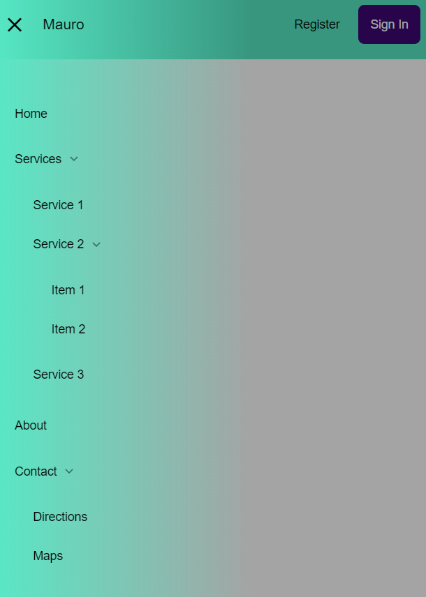

# navigation_bar
 
Navigation Bar responsive realizzata utilizzando HTML, CSS e Javascript.
Ho utilizzato anche tecnologie come SCSS, SASS e Laravel. 
La navigation bar è modile-friendly, oltre ad avere alcuni sottomenù.

---
## Mobile

---

### Complete

---

## Desktop

---

### Complete

